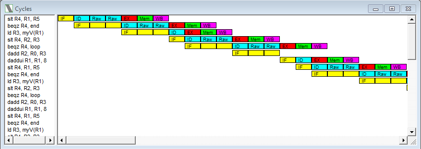
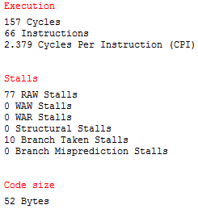
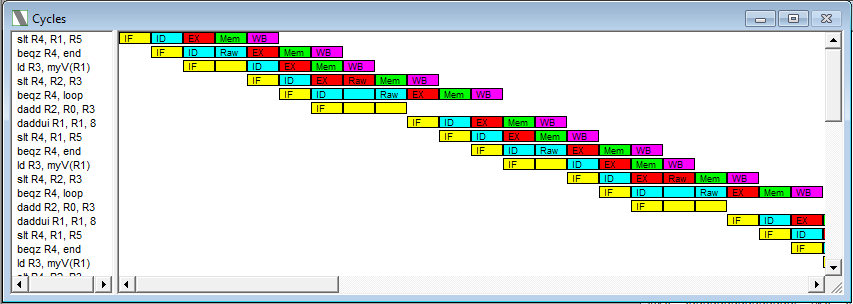
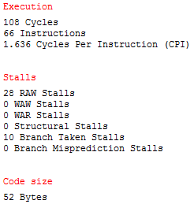
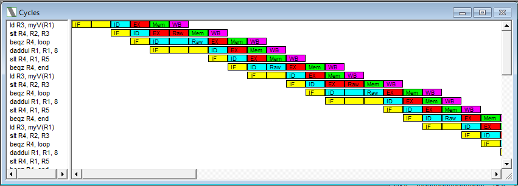
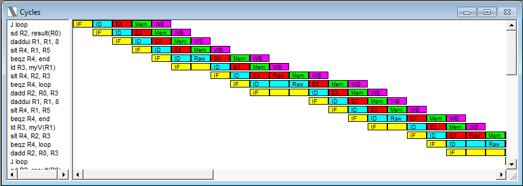
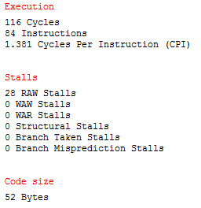
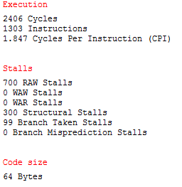
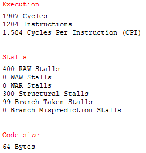

# Computer Architectures | II Part - Lab 1

### [Program_1.s](./files/scripts/program_1.s) - maximum in 10 element array
```
.data
    myV: .word 1, 10, 3, 4, 8, 6, 7, 8, 11, 2 	; 64-bit integers
    result:  .space 8 			; 8 empty bytes for result

.code
    ld R2, myV(R0) 				; first item as current maximum
    daddui R1, R0, 0			; R1 <- 0
    daddui R5, R0, 80			; 10 values , each 64 bits
loop: 						; from the second to the last item
    daddui R1, R1, 8 			; get ready for next iteration
    slt R4, R1, R5 				; R4 = 1 if R1 < 80, otherwise R4 = 0
    beqz R4, end 				; if R4 = 0 jump to end

    ld R3, myV(R1)				; load next item
    slt R4, R2, R3 				; R4 = 1 if R2 < R3, otherwise R4 = 0
    beqz R4, loop 				; if R4 = 0 jump to loop

    dadd R2, R0, R3				; we found a new maximum value
    J loop
end:
    sd R2, result(R0) 			; store the global maximum in result var

HALT
```
### Execution and analysis of program_1.s

#### All features disabled
This coniguration, the less optimized one, shows the highest count of total clock cycles.


#### Forwarding enabled


#### Forwarding and Branch Target Buffer enabled
Instruction *beqz* and *bnez* will have a 1 CC penalty without BTB enabled when the branch is taken.


#### Forwarding and Delay Slot enabled
Enabling delay slot proves beneficial with a code optimized for it: after the *beqz* there should be an instruction which is always executed, independently whether the branch is taken or not.



### [program_2.s](./files/scripts/program_2.s) - MIPS64 from high-level
```
.data
.data
v1: .double 1,2,3,4,5,6,7,8,9,10
v2: .double 1,2,3,4,5,6,7,8,9,10
v3: .double 1,2,3,4,5,6,7,8,9,10
v4: .double 1,2,3,4,5,6,7,8,9,10
v5: .double 1,2,3,4,5,6,7,8,9,10
v6: .double 1,2,3,4,5,6,7,8,9,10
v7: .double 1,2,3,4,5,6,7,8,9,10
.text
			daddu r1, r0, r0
			daddui r20, r0, 100
loop: l.d f1, v1(r1)
			l.d f2, v2(r1)
			l.d f3, v3(r1)
			l.d f4, v4(r1)
			mul.d f5, f1, f2
			div.d f6, f2, f3
			add.d f7, f4, f1
			s.d f5, v5(r1)
			s.d f6, v6(r1)
			s.d f7, v7(r1)
			daddui r1, r1, 8
			daddi r20, r20, -1
			bnez r20, loop

			HALT
```

The program should take 6 + 24*100 = 2406 clock cycles to run.

After *static rescheduling*, the code looks like so:
```
.text
			daddu r1, r0, r0
			daddui r20, r0, 100
loop: l.d f1, v1(r1)
			l.d f2, v2(r1)
			l.d f3, v3(r1)
			div.d f6, f2, f3
			l.d f4, v4(r1)
			mul.d f5, f1, f2
			add.d f7, f4, f1
			daddi r20, r20, -1
			s.d f7, v7(r1)
			s.d f5, v5(r1)
			s.d f6, v6(r1)
			bnez r20, loop
			daddui r1, r1, 8

			HALT
```
This version of the code should take less CC, 6 + 19*100 + 1 = 1907 to be precise.

