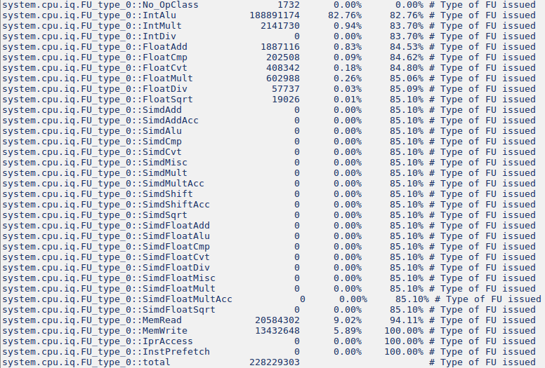
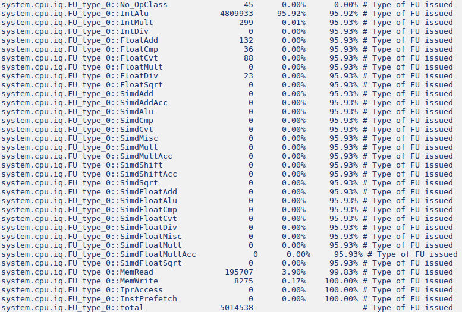
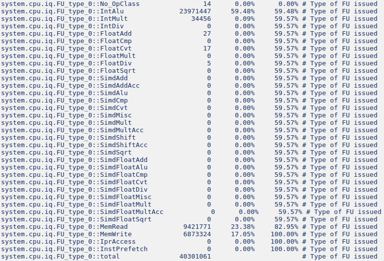
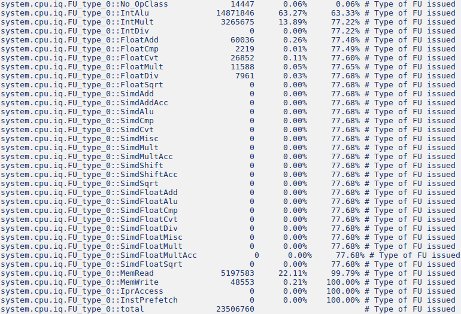

# Computer Architectures | II Part - Lab 2

### Ex 2 - Table of hello world simulations


### Ex 3 - automotive benchmarks with Deriv03CPU (Out-of-Order)


Instruction percentages:

- Basicmath

- Bitcount

- Quick Sort

- Susan


Pipeline Stages activity:
- Basicmath
```
Fetch:
system.cpu.fetch.Insts                      249665562                       # Number of instructions fetch has processed
system.cpu.fetch.Branches                    29917834                       # Number of branches that fetch encountered
system.cpu.fetch.predictedBranches           21146703                       # Number of branches that fetch has predicted taken
system.cpu.fetch.Cycles                      65540324                       # Number of cycles fetch has run and was not squashing or blocked
system.cpu.fetch.SquashCycles                 2063775                       # Number of cycles fetch has spent squashing

Decode:
system.cpu.decode.IdleCycles                 71055965                       # Number of cycles decode is idle
system.cpu.decode.BlockedCycles              34485749                       # Number of cycles decode is blocked
system.cpu.decode.RunCycles                  33897072                       # Number of cycles decode is running
system.cpu.decode.UnblockCycles               9501069                       # Number of cycles decode is unblocking
system.cpu.decode.SquashCycles                 844543                       # Number of cycles decode is squashing
system.cpu.decode.BranchResolved              5532395                       # Number of times decode resolved a branch
system.cpu.decode.BranchMispred                187385                       # Number of times decode detected a branch misprediction
system.cpu.decode.DecodedInsts              240315050                       # Number of instructions handled by decode
system.cpu.decode.SquashedInsts                434580                       # Number of squashed instructions handled by decode

Rename:
system.cpu.rename.serializeStallCycles       12713030                       # count of cycles rename stalled for serializing inst
system.cpu.rename.RunCycles                  39868981                       # Number of cycles rename is running
system.cpu.rename.UnblockCycles              21224731                       # Number of cycles rename is unblocking
system.cpu.rename.RenamedInsts              238080307                       # Number of instructions processed by rename
system.cpu.rename.ROBFullEvents                    65                       # Number of times rename has blocked due to ROB full
system.cpu.rename.IQFullEvents               19590353                       # Number of times rename has blocked due to IQ full
system.cpu.rename.LQFullEvents                    244                       # Number of times rename has blocked due to LQ full
system.cpu.rename.SQFullEvents                    563                       # Number of times rename has blocked due to SQ full

Issue:
system.cpu.iq.iqInstsIssued                 228229303                       # Number of instructions issued
system.cpu.iq.fu_full::No_OpClass                   0      0.00%      0.00% # attempts to use FU when none available
system.cpu.iq.fu_full::IntAlu                  857438     33.43%     33.43% # attempts to use FU when none available
system.cpu.iq.fu_full::IntMult                 495397     19.32%     52.75% # attempts to use FU when none available
system.cpu.iq.fu_full::IntDiv                       0      0.00%     52.75% # attempts to use FU when none available
system.cpu.iq.fu_full::FloatAdd                   936      0.04%     52.78% # attempts to use FU when none available
system.cpu.iq.fu_full::FloatCmp                    12      0.00%     52.78% # attempts to use FU when none available
system.cpu.iq.fu_full::FloatCvt                     0      0.00%     52.78% # attempts to use FU when none available
system.cpu.iq.fu_full::FloatMult                 3335      0.13%     52.91% # attempts to use FU when none available
system.cpu.iq.FU_type_0::No_OpClass              1732      0.00%      0.00% # Type of FU issued
system.cpu.iq.FU_type_0::IntAlu             188891174     82.76%     82.76% # Type of FU issued
system.cpu.iq.FU_type_0::IntMult              2141730      0.94%     83.70% # Type of FU issued
system.cpu.iq.FU_type_0::IntDiv                     0      0.00%     83.70% # Type of FU issued
system.cpu.iq.FU_type_0::FloatAdd             1887116      0.83%     84.53% # Type of FU issued
system.cpu.iq.FU_type_0::FloatCmp              202508      0.09%     84.62% # Type of FU issued
system.cpu.iq.FU_type_0::FloatCvt              408342      0.18%     84.80% # Type of FU issued
system.cpu.iq.FU_type_0::FloatMult             602988      0.26%     85.06% # Type of FU issued
system.cpu.iq.FU_type_0::FloatDiv               57737      0.03%     85.09% # Type of FU issued
system.cpu.iq.FU_type_0::FloatSqrt              19026      0.01%     85.10% # Type of FU issued
system.cpu.iq.FU_type_0::MemRead             20584302      9.02%     94.11% # Type of FU issued
system.cpu.iq.FU_type_0::MemWrite            13432648      5.89%    100.00% # Type of FU issued

Execute:
system.cpu.iew.lsq.thread0.forwLoads           832147                       # Number of loads that had data forwarded from stores
system.cpu.iew.lsq.thread0.invAddrLoads             0                       # Number of loads ignored due to an invalid address
system.cpu.iew.iewDispatchedInsts           236004227                       # Number of instructions dispatched to IQ
system.cpu.iew.exec_rate                     0.745006                       # Inst execution rate
system.cpu.iew.wb_rate                       0.743859                       # insts written-back per cycle

Commit:
system.cpu.commit.branchMispredicts            841640                       # The number of times a branch was mispredicted
system.cpu.commit.committedInsts            228103859                       # Number of instructions committed
system.cpu.commit.refs                       32653304                       # Number of memory references committed
system.cpu.commit.loads                      19560362                       # Number of loads committed
system.cpu.commit.membars                      115466                       # Number of memory barriers committed
system.cpu.commit.branches                   27029484                       # Number of branches committed
system.cpu.commit.fp_insts                    4603332                       # Number of committed floating point instructions.
system.cpu.commit.int_insts                 216359787                       # Number of committed integer instructions.
system.cpu.commit.function_calls              2432739                       # Number of function calls committed.
system.cpu.commit.op_class_0::No_OpClass      5230603      2.29%      2.29% # Class of committed instruction
system.cpu.commit.op_class_0::IntAlu        184816092     81.02%     83.32% # Class of committed instruction
system.cpu.commit.op_class_0::IntMult         2140284      0.94%     84.25% # Class of committed instruction
system.cpu.commit.op_class_0::MemRead        19675828      8.63%     94.26% # Class of committed instruction
system.cpu.commit.op_class_0::MemWrite       13092943      5.74%    100.00% # Class of committed instruction
```
- Bitcount
```
Fetch:
system.cpu.fetch.Insts                        5916701                       # Number of instructions fetch has processed
system.cpu.fetch.Branches                      841522                       # Number of branches that fetch encountered
system.cpu.fetch.predictedBranches             803768                       # Number of branches that fetch has predicted taken
system.cpu.fetch.Cycles                       1238842                       # Number of cycles fetch has run and was not squashing or blocked
system.cpu.fetch.branchRate                  0.546348                       # Number of branch fetches per cycle
system.cpu.fetch.rate                        3.841348                       # Number of inst fetches per cycle

Decode:
system.cpu.decode.BranchResolved                 2430                       # Number of times decode resolved a branch
system.cpu.decode.BranchMispred                   345                       # Number of times decode detected a branch misprediction
system.cpu.decode.DecodedInsts                5668856                       # Number of instructions handled by decode

Rename:
system.cpu.rename.ROBFullEvents                    11                       # Number of times rename has blocked due to ROB full
system.cpu.rename.IQFullEvents                  53995                       # Number of times rename has blocked due to IQ full
system.cpu.rename.LQFullEvents                    125                       # Number of times rename has blocked due to LQ full
system.cpu.rename.SQFullEvents                    550                       # Number of times rename has blocked due to SQ full

Issue:
system.cpu.iq.issued_per_cycle::total         1467268                       # Number of insts issued each cycle
system.cpu.iq.fu_full::No_OpClass                   0      0.00%      0.00% # attempts to use FU when none available
system.cpu.iq.fu_full::IntAlu                   68576     98.43%     98.43% # attempts to use FU when none available
system.cpu.iq.FU_type_0::IntAlu               4809933     95.92%     95.92% # Type of FU issued
system.cpu.iq.rate                           3.255629                       # Inst issue rate

Execute:
system.cpu.iew.exec_swp                             0                       # number of swp insts executed
system.cpu.iew.exec_nop                         33531                       # number of nop insts executed
system.cpu.iew.exec_refs                       203375                       # number of memory reference insts executed
system.cpu.iew.exec_branches                   615687                       # Number of branches executed
system.cpu.iew.exec_stores                       8143                       # Number of stores executed
system.cpu.iew.exec_rate                     3.236406                       # Inst execution rate
system.cpu.iew.wb_sent                        4984260                       # cumulative count of insts sent to commit
system.cpu.iew.wb_count                       4983951                       # cumulative count of insts written-back

Commit:
system.cpu.commit.swp_count                         0                       # Number of s/w prefetches committed
system.cpu.commit.refs                         200454                       # Number of memory references committed
system.cpu.commit.loads                        193000                       # Number of loads committed
system.cpu.commit.membars                          44                       # Number of memory barriers committed
system.cpu.commit.branches                     593393                       # Number of branches committed
system.cpu.commit.fp_insts                        500                       # Number of committed floating point instructions.
system.cpu.commit.int_insts                   4671246                       # Number of committed integer instructions.
system.cpu.commit.function_calls                53566                       # Number of function calls committed.
system.cpu.commit.op_class_0::No_OpClass        31952      0.68%      0.68% # Class of committed instruction
system.cpu.commit.op_class_0::IntAlu          4471304     95.05%     95.73% # Class of committed instruction
```

- Quick Sort
```
Fetch:
system.cpu.fetch.Insts                       47243188                       # Number of instructions fetch has processed
system.cpu.fetch.Branches                     6583970                       # Number of branches that fetch encountered
system.cpu.fetch.predictedBranches            4597936                       # Number of branches that fetch has predicted taken
system.cpu.fetch.rate                        1.478022                       # Number of inst fetches per cycle

Decode:
system.cpu.decode.BranchResolved              1240743                       # Number of times decode resolved a branch
system.cpu.decode.BranchMispred                   423                       # Number of times decode detected a branch misprediction
system.cpu.decode.DecodedInsts               46205413                       # Number of instructions handled by decode

Rename:
system.cpu.rename.ROBFullEvents                 87234                       # Number of times rename has blocked due to ROB full
system.cpu.rename.IQFullEvents                1220098                       # Number of times rename has blocked due to IQ full
system.cpu.rename.LQFullEvents                 893423                       # Number of times rename has blocked due to LQ full
system.cpu.rename.SQFullEvents                8990636                       # Number of times rename has blocked due to SQ full

Issue:
system.cpu.iq.issued_per_cycle::total        31909108                       # Number of insts issued each cycle
system.cpu.iq.fu_full::No_OpClass                   0      0.00%      0.00% # attempts to use FU when none available
system.cpu.iq.fu_full::IntAlu                  118981     10.97%     10.97% # attempts to use FU when none available
system.cpu.iq.fu_full::MemRead                 656250     60.51%     71.48% # attempts to use FU when none available
system.cpu.iq.fu_full::MemWrite                309379     28.52%    100.00% # attempts to use FU when none available

Execute:
system.cpu.iew.exec_swp                             0                       # number of swp insts executed
system.cpu.iew.exec_nop                       4972758                       # number of nop insts executed
system.cpu.iew.exec_refs                     16190534                       # number of memory reference insts executed
system.cpu.iew.exec_branches                  6083417                       # Number of branches executed
system.cpu.iew.exec_stores                    6848559                       # Number of stores executed
system.cpu.iew.exec_rate                     1.254399                       # Inst execution rate
system.cpu.iew.wb_sent                       39010149                       # cumulative count of insts sent to commit
system.cpu.iew.wb_count                      38930685                       # cumulative count of insts written-back

Commit:
system.cpu.commit.op_class_0::No_OpClass      4614040     11.32%     11.32% # Class of committed instruction
system.cpu.commit.op_class_0::IntAlu         21668949     53.17%     64.49% # Class of committed instruction
system.cpu.commit.op_class_0::MemRead         7965644     19.55%     84.10% # Class of committed instruction
system.cpu.commit.op_class_0::MemWrite        6481609     15.90%    100.00% # Class of committed instruction

```
- Susan
```
Fetch:
system.cpu.fetch.Insts                       29742040                       # Number of instructions fetch has processed
system.cpu.fetch.Branches                     2361956                       # Number of branches that fetch encountered
system.cpu.fetch.predictedBranches            2224137                       # Number of branches that fetch has predicted taken
system.cpu.fetch.Cycles                       5059289                       # Number of cycles fetch has run and was not squashing or blocked

Decode:
system.cpu.decode.BranchResolved               119326                       # Number of times decode resolved a branch
system.cpu.decode.BranchMispred                   349                       # Number of times decode detected a branch misprediction
system.cpu.decode.DecodedInsts               27545070                       # Number of instructions handled by decode

Rename:
system.cpu.rename.ROBFullEvents                  2309                       # Number of times rename has blocked due to ROB full
system.cpu.rename.IQFullEvents                  20507                       # Number of times rename has blocked due to IQ full
system.cpu.rename.LQFullEvents                 122781                       # Number of times rename has blocked due to LQ full
system.cpu.rename.SQFullEvents                  10360                       # Number of times rename has blocked due to SQ full

Issue:
system.cpu.iq.issued_per_cycle::total         5613800                       # Number of insts issued each cycle
system.cpu.iq.fu_full::No_OpClass                   0      0.00%      0.00% # attempts to use FU when none available
system.cpu.iq.fu_full::IntAlu                     184      1.14%      1.14% # attempts to use FU when none available
system.cpu.iq.fu_full::IntMult                  14248     88.06%     89.20% # attempts to use FU when none available
system.cpu.iq.FU_type_0::IntAlu              14871846     63.27%     63.33% # Type of FU issued
system.cpu.iq.FU_type_0::IntMult              3265675     13.89%     77.22% # Type of FU issued
system.cpu.iq.FU_type_0::MemRead              5197583     22.11%     99.79% # Type of FU issued
system.cpu.iq.FU_type_0::MemWrite               48553      0.21%    100.00% # Type of FU issued

Execute:
system.cpu.iew.exec_swp                             0                       # number of swp insts executed
system.cpu.iew.exec_nop                        387139                       # number of nop insts executed
system.cpu.iew.exec_refs                      5029059                       # number of memory reference insts executed
system.cpu.iew.exec_branches                  1910719                       # Number of branches executed
system.cpu.iew.exec_stores                      48457                       # Number of stores executed
system.cpu.iew.exec_rate                     4.076695                       # Inst execution rate
system.cpu.iew.wb_sent                       23062952                       # cumulative count of insts sent to commit
system.cpu.iew.wb_count                      23061510                       # cumulative count of insts written-back

Commit:
system.cpu.commit.op_class_0::IntAlu         14175683     61.80%     63.45% # Class of committed instruction
system.cpu.commit.op_class_0::IntMult         3265440     14.24%     77.69% # Class of committed instruction
system.cpu.commit.op_class_0::MemRead         4962871     21.64%     99.80% # Class of committed instruction
system.cpu.commit.op_class_0::MemWrite          46827      0.20%    100.00% # Class of committed instruction
```
